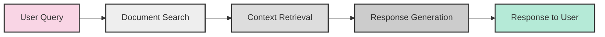
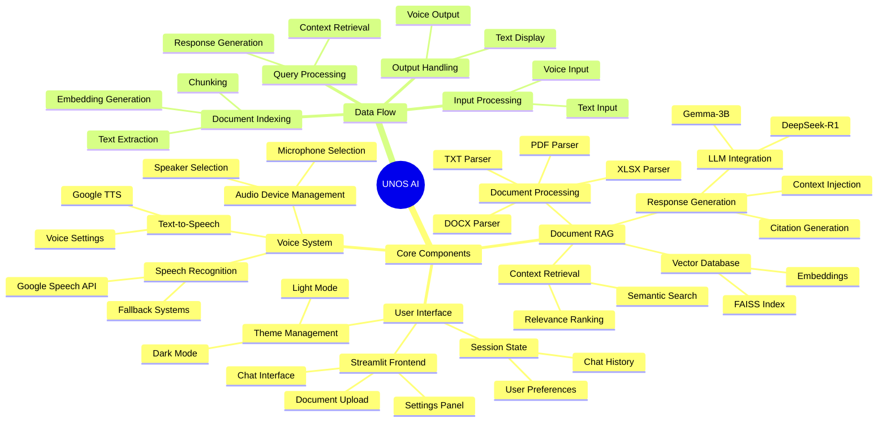

# UNOS AI Assistant

<div align="center">
  
  <p><em>Your documents, intelligently answered</em></p>

  [](https://www.python.org/)
  [](https://streamlit.io/)
  [](https://pytorch.org/)
  [](LICENSE)
</div>

## 🌟 Features

### 📄 Document Intelligence
- **Multi-format Support**: Process PDF, DOCX, TXT, XLSX, CSV, and more
- **Smart Indexing**: Efficiently index and search through document content
- **Context-aware Responses**: Get answers that reference specific parts of your documents

### 🧠 AI Capabilities
- **Local LLM Integration**: Uses DeepSeek-R1 and Gemma-3B models for privacy and speed
- **Retrieval-Augmented Generation (RAG)**: Combines document retrieval with generative AI
- **Customizable Parameters**: Adjust context length, temperature, and other generation settings

### 💻 User Experience
- **Intuitive Chat Interface**: Simple, conversational UI for asking questions
- **Dark/Light Mode**: Choose your preferred visual theme
- **Session Persistence**: Chat history and document indexes are preserved between sessions

### 🎤 Voice Interaction (Optional)
- **Voice Input**: Ask questions using your microphone
- **Voice Output**: Have responses read aloud with natural-sounding speech
- **Device Selection**: Choose from available microphones and speakers

## 🚀 Getting Started

### Prerequisites
- Python 3.8 or higher
- Windows operating system
- 8GB+ RAM recommended for optimal performance
- GPU acceleration supported but not required

### Installation

1. Clone the repository:
```bash
git clone https://github.com/yourusername/unos-ai.git
cd unos-ai
```

2. Install dependencies:
```bash
pip install -r requirements.txt
```

3. Download the language models:
- DeepSeek-R1
- Gemma-3B

4. Run the application:
```bash
python -m streamlit run main.py
```

## 📖 Usage Guide

### Document Management
- Click "Upload Documents" in the sidebar
- Select one or more files to upload
- Wait for the indexing process to complete
- Use the document browser to view uploaded files

### Asking Questions
- Type your question in the chat input field
- Press Enter or click the send button
- View the AI-generated response with citations
- Continue the conversation with follow-up questions

### Voice Interaction
- Click the microphone button to activate voice input
- Speak your question clearly
- Toggle "Enable Voice Output" to have responses read aloud
- Use the stop button to interrupt voice input/output

### Settings & Customization
- Select your preferred language model
- Adjust RAG parameters for retrieval precision
- Configure voice settings if using speech features
- Toggle between dark and light themes

## 🏗️ Architecture
UNOS AI follows a modular architecture with these key components:
- Document Processing: Handles parsing and indexing of various file formats
- RAG Engine: Manages document retrieval and context preparation
- Language Models: Generates responses based on queries and context
- UI Layer: Streamlit-based interface with responsive design
- Voice System: Optional speech recognition and synthesis capabilities

For more details, see [ARCHITECTURE.md](ARCHITECTURE.md).

## 🔍 System Diagrams

### Component Flow


### System Mindmap


## 🛠️ Technologies Used
- Streamlit
- PyTorch
- Transformers
- FAISS
- Google Speech
- Google TTS
- NumPy
- Pillow

## 🤝 Contributing
Contributions are welcome! Please follow these steps:

1. Fork the repository
2. Create your feature branch (`git checkout -b feature/amazing-feature`)
3. Commit your changes (`git commit -m 'Add some amazing feature'`)
4. Push to the branch (`git push origin feature/amazing-feature`)
5. Open a Pull Request

## 📄 License
This project is licensed under the MIT License - see the [LICENSE](LICENSE) file for details.

## 🙏 Acknowledgments
- Built with Streamlit
- Powered by DeepSeek and Gemma language models
- Uses FAISS for vector search
- Speech recognition powered by Google Speech API
