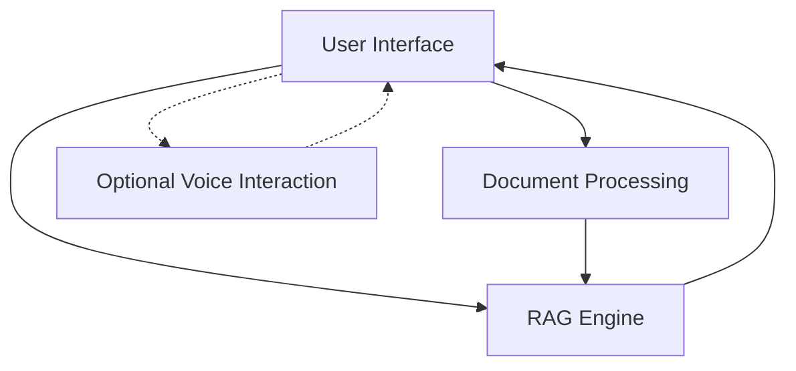

# UNOS AI Assistant
UNOS AI is an advanced document-based question answering system with voice interaction capabilities. It allows users to upload documents, ask questions about their content, and receive AI-generated responses with optional voice output.

## Features
- Document Processing : Upload and process various document formats (PDF, DOCX, TXT, etc.)
- AI-Powered Responses : Get accurate answers based on your document content
- Voice Interaction : Ask questions using your voice and hear responses
- Multiple LLM Support : Switch between different language models
- Dark/Light Mode : Choose your preferred UI theme
- Customizable Audio Settings : Select microphones, speakers, and voice profiles
## Screenshots
## Installation
1. Clone the repository:
```bash
git clone https://github.com/yourusername/unos-ai.git
cd unos-ai
 ```
```

2. Install dependencies:
```bash
pip install -r requirements.txt
 ```

3. Run the application:
```bash
python -m streamlit run main.py
 ```

## Usage
1. Upload Documents : Use the sidebar to upload your documents
2. Ask Questions : Type or speak your questions about the documents
3. Get Answers : Receive AI-generated responses based on document content
4. Voice Output : Toggle voice response to hear answers read aloud
## Configuration
- Model Selection : Choose between DeepSeek-R1 and Gemma-3B models
- Audio Settings : Configure microphone and speaker settings
- Voice Settings : Select text-to-speech engine and options
- UI Theme : Toggle between dark and light mode
## Requirements
- Python 3.8+
- See requirements.txt for all dependencies
## Architecture
See ARCHITECTURE.md for detailed system design information.

## License
This project is licensed under the MIT License - see the LICENSE file for details.

## Acknowledgments
- Built with Streamlit
- Powered by DeepSeek and Gemma language models
- Uses various open-source libraries for document processing and speech recognition
Now I'll create the ARCHITECTURE.md file:

```markdown
# UNOS AI Architecture

## System Overview

UNOS AI is built with a modular architecture that separates concerns between document processing, RAG (Retrieval-Augmented Generation), UI components, and optional voice interaction. The system is designed to work primarily with text input, with voice capabilities as an optional enhancement.



## Core Components
### 1. Document RAG (Retrieval-Augmented Generation)
The DocumentRAG class in app/core/document_rag.py is the central component that:

- Processes and indexes uploaded documents
- Searches for relevant context based on user queries
- Generates responses using the selected language model
```mermaid
graph LR
    A[User Query] --> B[Document Search]
    B --> C[Context Retrieval]
    C --> D[Response Generation]
    D --> E[Response to User]
 ```

### 2. UI Components
The UI is built with Streamlit and organized into modular components:

- main.py : Application entry point and session state management
- app/ui/styles.py : Custom CSS and theme management
- app/ui/sidebar.py : Document upload and settings sidebar
- app/ui/chat.py : Chat interface and voice interaction
### 3. Voice Interaction System
Voice capabilities are implemented through:

- Speech recognition using Google Speech Recognition API with fallbacks
- Text-to-speech using Google TTS (gTTS)
- Audio device management for microphone and speaker selection
```mermaid
graph LR
    A[User Query] --> B[Document Search]
    B --> C[Context Retrieval]
    C --> D[Response Generation]
    D --> E[Response to User]
 ```

## Data Flow
1. User uploads documents through the sidebar
2. Documents are processed and indexed by the RAG engine
3. User asks a question via text or voice
4. System searches for relevant context in the indexed documents
5. Language model generates a response based on the context
6. Response is displayed to the user and optionally read aloud
## Technology Stack
- Frontend : Streamlit
- Language Models : DeepSeek-R1, Gemma-3B
- Embeddings : Sentence Transformers
- Vector Search : FAISS
- Speech Recognition : Google Speech API, with optional Whisper/Vosk fallbacks
- Text-to-Speech : Google TTS (gTTS)
- Document Processing : PyPDF2, python-docx, etc.
## Design Patterns
- Singleton Pattern : Session state management
- Factory Pattern : Document processor selection based on file type
- Strategy Pattern : Switching between different language models
- Observer Pattern : UI updates based on state changes
## Future Architecture Improvements
- Implement caching for faster response generation
- Add distributed processing for handling larger document collections
- Implement streaming responses for better user experience
- Add user authentication and document persistence
